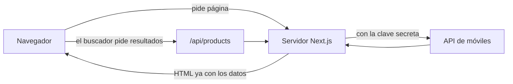
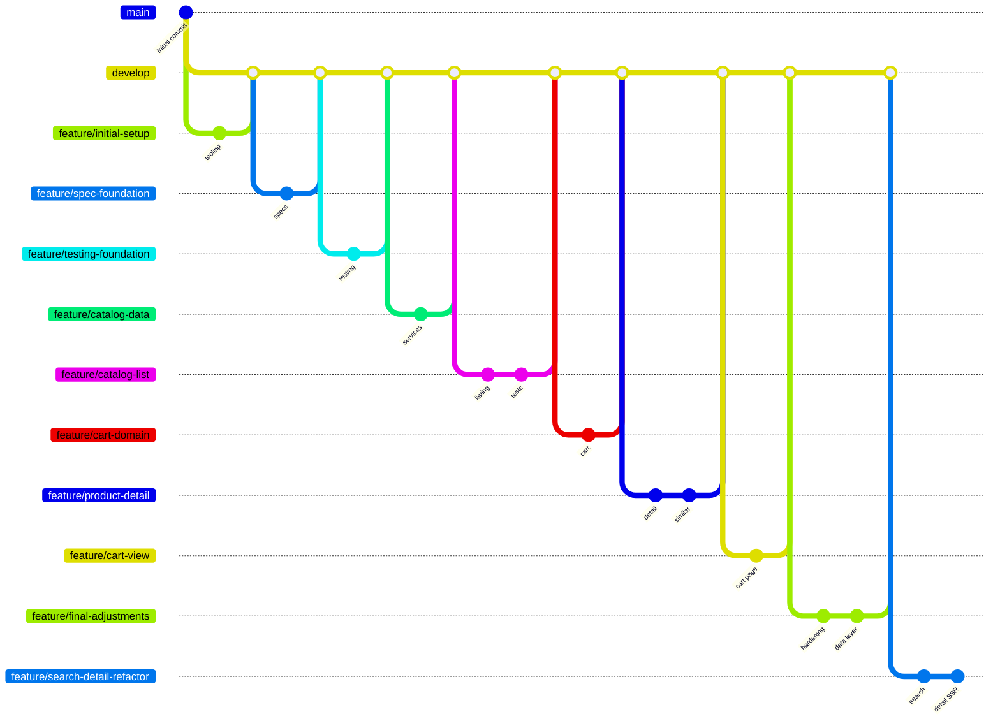

# MBST – Tienda de móviles

Tienda de smartphones con catálogo, buscador, ficha de producto configurable y carrito. Está hecha con Next.js (App Router), React y TypeScript, y consume una API externa de móviles.

**Demo:** [zara-technical-challenge.vercel.app](https://zara-technical-challenge.vercel.app)

**Recursos del reto:** [diseño en Figma](https://www.figma.com/design/Nuic7ePgOfUQ0hcBrUUQrb/Labs---Zara-Web-Challenge--Smartphones-?node-id=0-1&p=f&t=PKOirkJyKSZ65CkL-0) · [documentación de la API](https://prueba-tecnica-api-tienda-moviles.onrender.com/docs/)

- **Catálogo** (`/`): los 20 primeros móviles y un buscador por nombre o marca.
- **Detalle** (`/product/[id]`): imagen, especificaciones, elección de color y almacenamiento, y móviles similares.
- **Carrito** (`/cart`): lista de lo que has añadido, total y opción de quitar unidades. Se guarda en el navegador y sigue ahí si recargas.

## Índice

- [El reto](#el-reto)
- [Cómo ejecutarlo](#cómo-ejecutarlo)
- [Cómo está organizado](#cómo-está-organizado)
- [Accesibilidad y responsive](#accesibilidad-y-responsive)
- [Ramas del repositorio](#ramas-del-repositorio)
- [Cómo se ha desarrollado (desarrollo agéntico)](#cómo-se-ha-desarrollado-desarrollo-agéntico)
- [Preguntas y respuestas](#preguntas-y-respuestas)
- [Más información](#más-información)

## El reto

El enunciado pide una tienda de smartphones con tres pantallas (catálogo, detalle y carrito) y una serie de requisitos de calidad. Esto es lo que se pedía y dónde está resuelto:

### Funcionalidad

| Pantalla | Qué se pedía                   | Cómo está resuelto                                                                                                                     |
| -------- | ------------------------------ | -------------------------------------------------------------------------------------------------------------------------------------- |
| Catálogo | Los 20 primeros móviles        | La página pide 20 resultados a la API y los muestra en una cuadrícula.                                                                 |
| Catálogo | Buscar por nombre o marca      | El buscador consulta a la API (no filtra en el navegador), espera a que dejes de escribir y guarda la búsqueda en la URL (`?search=`). |
| Catálogo | Contador de resultados         | Muestra el número devuelto por la API para la búsqueda actual.                                                                         |
| Catálogo | Acceso al carrito              | La cabecera enseña el número de unidades y enlaza a `/cart`.                                                                           |
| Detalle  | Imagen que cambia con el color | Al elegir un color se cambia la imagen.                                                                                                |
| Detalle  | Elegir almacenamiento y color  | Botones de opción nativos; "AÑADIR" no se activa hasta elegir ambos.                                                                   |
| Detalle  | Precio que se actualiza        | Al elegir almacenamiento, el precio pasa a ser el de esa capacidad.                                                                    |
| Detalle  | Especificaciones técnicas      | Se muestran en una lista con todas las características que devuelve la API.                                                            |
| Detalle  | Productos similares            | Carrusel horizontal con enlace al detalle de cada uno. Si no hay, la sección se oculta.                                                |
| Carrito  | Lista persistente              | Cada unidad con su color y almacenamiento, guardada en `localStorage`; sigue ahí al recargar.                                          |
| Carrito  | Quitar una unidad              | Cada unidad se quita por separado, sin afectar a las demás.                                                                            |
| Carrito  | Precio total                   | Se suma en céntimos para no tener errores de decimales.                                                                                |
| Carrito  | Volver al catálogo             | Enlace "Continue shopping".                                                                                                            |

### Calidad

| Requisito                     | Cómo se cubre                                                                                                                               |
| ----------------------------- | ------------------------------------------------------------------------------------------------------------------------------------------- |
| Pruebas                       | Unitarias y de componentes (Vitest), accesibilidad (axe) y navegador real (Playwright).                                                     |
| Responsive                    | Móvil, tablet y escritorio. Ver [Accesibilidad y responsive](#accesibilidad-y-responsive).                                                  |
| Accesibilidad                 | Teclado, lectores de pantalla y pruebas automáticas. Ver [Accesibilidad y responsive](#accesibilidad-y-responsive).                         |
| Linter y formateador          | Biome, con revisión automática antes de cada commit.                                                                                        |
| Consola sin errores ni avisos | Las pruebas de Playwright lo comprueban en el carrito, y en el catálogo y el detalle cuando se ejecutan con la API real (`E2E_LIVE_API=1`). |
| Documentación                 | Este README y la especificación en [docs/specs/catalog-and-cart.md](docs/specs/catalog-and-cart.md).                                        |

### Extras

- **Despliegue:** la demo está en Vercel.
- **Renderizado en el servidor:** las páginas llegan al navegador ya con los datos (Next.js).
- **Variables CSS:** colores, márgenes y alturas se definen una vez y se reutilizan.

### Fuera de alcance

El enunciado no define un flujo de pago, así que el carrito termina en "Continue shopping". Más detalles en [Límites y siguientes pasos](#límites-y-siguientes-pasos).

## Screenshots

### Catálogo


### Búsqueda


### Detalle


### Carrito


## Cómo ejecutarlo

### Requisitos

- **Node 24** (el repo incluye `.nvmrc`; con `nvm use` o `fnm use` se activa solo). Se usa esta versión porque Node 18, que mencionaba el enunciado, ya no recibe soporte y Vercel, donde está desplegada la demo, trabaja con versiones que sí lo reciben.
- **npm** (viene con Node).
- Una clave de la API de móviles.

### Pasos

```bash
# 1. Instalar dependencias
npm install

# 2. Crear tu fichero de variables de entorno a partir del ejemplo
cp .env.example .env.local     # en PowerShell: Copy-Item .env.example .env.local

# 3. Abrir .env.local y poner tu clave en PHONES_API_KEY

# 4. Arrancar en desarrollo
npm run dev
```

Abre <http://localhost:3000>.

### Variables de entorno

| Variable              | Para qué sirve                                                                          |
| --------------------- | --------------------------------------------------------------------------------------- |
| `PHONES_API_BASE_URL` | Dirección de la API. Ya viene rellena en `.env.example`.                                |
| `PHONES_API_KEY`      | Tu clave de la API. **Es secreta**: solo la lee el servidor y nunca llega al navegador. |

`.env.local` está ignorado por Git, así que tu clave no se sube al repositorio.

> La API está alojada en un plan gratuito que se "duerme" si no recibe visitas. La primera petición puede tardar bastante; es normal, y por eso la app espera hasta 60 segundos antes de rendirse.

### Desarrollo y producción

La misma app se puede ejecutar de dos maneras, pensadas para cosas distintas:

|                      | Desarrollo                                              | Producción                                                             |
| -------------------- | ------------------------------------------------------- | ---------------------------------------------------------------------- |
| Comando              | `npm run dev`                                           | `npm run build` y después `npm start`                                  |
| Para qué sirve       | Programar: los cambios se ven al guardar, sin reiniciar | Ver la app tal y como la ve el usuario final                           |
| Velocidad            | Más lenta y con código sin optimizar                    | Compilada y optimizada                                                 |
| Errores              | Muestra avisos y errores detallados en pantalla         | Muestra las pantallas de error de la app, sin detalles técnicos        |
| Dónde corre          | Tu ordenador, en `http://localhost:3000`                | Tu ordenador (`npm start`) o Vercel, en la demo                        |
| Variables de entorno | Se leen de `.env.local`                                 | En Vercel se configuran en el propio proyecto; `.env.local` no se sube |

Cosas a tener en cuenta:

- **Prueba en producción antes de dar algo por bueno.** Hay problemas que solo aparecen en la versión compilada (por ejemplo, avisos en la consola o CSS que se comporta distinto). Por eso las pruebas de Playwright compilan la app y la ejecutan en modo producción, en el puerto 3100.
- **Si cambias la configuración de PostCSS**, reinicia `npm run dev`: no se recarga sola.
- **La demo se despliega desde `main`.** El trabajo diario se integra en `develop` y solo llega a `main` (y, con ello, a producción) cuando se hace una release.

### Otros comandos

| Comando                           | Qué hace                                                                                                                                                  |
| --------------------------------- | --------------------------------------------------------------------------------------------------------------------------------------------------------- |
| `npm run build` y `npm start`     | Compila y arranca la versión de producción.                                                                                                               |
| `npm test`                        | Pruebas unitarias y de componentes (Vitest).                                                                                                              |
| `npm run test:coverage`           | Lo mismo, con informe de cobertura.                                                                                                                       |
| `npm run test:e2e`                | Pruebas en un navegador real (Playwright). Compila y arranca la app en el puerto 3100. La primera vez hay que ejecutar `npx playwright install chromium`. |
| `E2E_LIVE_API=1 npm run test:e2e` | Igual, pero incluye las pruebas que llaman a la API de verdad (necesita tu clave).                                                                        |
| `npm run check`                   | Revisa formato y errores de estilo con Biome.                                                                                                             |
| `npm run format`                  | Formatea el código.                                                                                                                                       |
| `npm run typecheck`               | Comprueba los tipos de TypeScript.                                                                                                                        |

## Cómo está organizado

```text
src/
├── app/                  Páginas y rutas (Next.js App Router)
│   ├── page.tsx              Catálogo
│   ├── product/[id]/         Detalle del producto
│   ├── cart/                 Carrito
│   ├── api/products/         Ruta interna que usa el buscador
│   ├── error.tsx, not-found.tsx, loading.tsx   Pantallas de error, "no existe" y carga
│   └── globals.css           Colores, espacios y otras variables de diseño
├── components/           Piezas de pantalla (catálogo, detalle, carrito, barra de carga…)
├── context/              Estado del carrito (contexto, reducer y guardado en el navegador)
├── services/             Todo lo que habla con la API externa
├── types/                Tipos de los datos y comprobaciones de que la API responde lo esperado
├── utils/                Funciones pequeñas: dinero, URLs de búsqueda, https
├── hooks/                Hooks reutilizables
├── styles/               Puntos de corte de pantalla compartidos (móvil, tablet, escritorio)
└── test/                 Utilidades y datos de prueba
e2e/                      Pruebas de navegador (Playwright)
docs/specs/               Especificación funcional del proyecto
```

### Cómo viaja la información



1. Cuando entras en una página, **el servidor** le pregunta a la API y te devuelve la página ya con los datos.
2. Cuando escribes en el buscador, el navegador le pide los resultados a nuestra ruta `/api/products`, que a su vez le pregunta a la API. El navegador nunca habla directamente con la API.
3. El carrito vive solo en el navegador (contexto de React + `localStorage`).

### Reglas del proyecto

- **Cada cosa en su sitio**: los componentes pintan, los servicios hablan con la API, los `utils` hacen cuentas y los tipos describen los datos.
- **No nos fiamos de la API**: lo que llega se comprueba antes de usarse. Si falta algo, se muestra un error claro en vez de que la página se rompa.
- **Diseño con variables**: colores, márgenes y alturas se definen una vez en `globals.css` y se reutilizan.

## Accesibilidad y responsive

### Accesibilidad

La idea es que la tienda se pueda usar con teclado y con lector de pantalla, no solo con ratón.

- **Elementos nativos.** Color y almacenamiento son botones de opción (`radio`) reales, y el buscador tiene su `label`. El teclado y los lectores funcionan sin código extra.
- **Todo se puede alcanzar con el teclado**, y siempre se ve dónde está el foco: hay un contorno común (`--focus-outline`) en enlaces, botones, opciones y en el carrusel de similares.
- **Nombres claros para el lector de pantalla:**
  - las tarjetas anuncian marca, nombre y precio;
  - el botón de quitar dice qué unidad quita (por ejemplo, marca, modelo, capacidad y color);
  - los iconos decorativos se ocultan y las zonas de la página tienen nombre propio (navegación principal, controles del catálogo, resultados…).
- **Avisos de estado:**
  - el contador de resultados se anuncia solo cuando cambia (`aria-live`);
  - la barra de carga tiene un texto oculto ("Loading phones", "Loading product details");
  - los errores se anuncian como alerta y "sin resultados" como estado, y los contenedores se marcan como ocupados mientras cargan (`aria-busy`).
- **Carrusel de similares** con foco de teclado y descripción para lectores de pantalla.
- **Movimiento reducido:** las animaciones se desactivan si el usuario lo pide en su sistema (`prefers-reduced-motion`).
- **Pruebas automáticas:** las de accesibilidad con axe (`src/test/a11y.test.tsx`) revisan las páginas reales (catálogo, detalle y carrito) y avisan si aparece un fallo, por ejemplo zonas con el mismo nombre.

Lo que no sustituye: las pruebas automáticas no detectan todo, así que conviene revisarlo también a mano con el teclado.

### Responsive

Se diseña primero para móvil y se amplía con dos puntos de corte, definidos una sola vez en `src/styles/media.css`:

| Pantalla   | Ancho         | Márgenes de página | Catálogo   |
| ---------- | ------------- | ------------------ | ---------- |
| Móvil      | hasta 767 px  | 16 px              | 1 columna  |
| Tablet     | desde 768 px  | 40 px              | 2 columnas |
| Escritorio | desde 1280 px | 100 px             | 5 columnas |

- **Detalle:** el diseño cambia entre móvil, tablet y escritorio (imagen, opciones y tabla de especificaciones se reordenan).
- **Carrito:** en móvil el total queda encima de dos botones iguales, y en tablet y escritorio se muestra en una sola fila.
- **Sin scroll horizontal accidental:** la única zona que se desplaza en horizontal es el carrusel de similares, a propósito.
- **Comprobado en el navegador:** las pruebas de Playwright miden el carrito a 393, 768 y 1280 px de ancho y comprueban que no haya desbordes ni avisos en la consola.

## Ramas del repositorio

El proyecto sigue **GitFlow** de forma sencilla: `main` guarda la base, `develop` reúne el trabajo ya terminado y cada tema se desarrolla en su propia rama `feature/*`. Cuando una rama está lista, se fusiona en `develop` con `git merge --no-ff` (así queda un commit de fusión y se ve dónde empezó y acabó cada tema).



| Rama                             | Qué se trabajó                                                                                                                                                                                                                                                              |
| -------------------------------- | --------------------------------------------------------------------------------------------------------------------------------------------------------------------------------------------------------------------------------------------------------------------------- |
| `main`                           | Solo el commit inicial de Create Next App. Es la base sin tocar.                                                                                                                                                                                                            |
| `develop`                        | Rama de integración: recibe todas las `feature/*` ya terminadas.                                                                                                                                                                                                            |
| `feature/initial-setup`          | Herramientas del proyecto: Biome (en lugar de ESLint), Husky, GitHub Actions, Node fijado en `.nvmrc`, configuración de PostCSS y TypeScript, variables de entorno de ejemplo y el cliente base de la API.                                                                  |
| `feature/spec-foundation`        | Documentación antes de programar: la especificación de catálogo y carrito, y los estados del detalle (carga, error, sin similares).                                                                                                                                         |
| `feature/testing-foundation`     | Base de pruebas: Vitest, Testing Library y MSW, con su configuración común, y los tests añadidos a CI y al hook de Husky.                                                                                                                                                   |
| `feature/catalog-data`           | Capa de datos en el servidor: cliente de la API, servicios de catálogo y detalle, y tipos.                                                                                                                                                                                  |
| `feature/catalog-list`           | Pantalla del catálogo: cuadrícula responsive, tarjetas, buscador y estados (carga, error, sin resultados), con sus tests.                                                                                                                                                   |
| `feature/cart-domain`            | Lógica del carrito: contexto de React, reducer y guardado en `localStorage`.                                                                                                                                                                                                |
| `feature/product-detail`         | Ficha del producto: ruta de detalle, elección de color y almacenamiento, y carrusel de móviles similares con scroll propio.                                                                                                                                                 |
| `feature/cart-view`              | Página del carrito: lista de unidades, total, quitar y estado vacío, adaptada a móvil, tablet y escritorio.                                                                                                                                                                 |
| `feature/final-adjustments`      | Robustez y acabado: cliente de la API con timeout y errores propios, imágenes siempre en `https`, precios exactos (céntimos), pantallas de error y "no existe", variables de diseño en CSS y las primeras pruebas e2e con Playwright.                                       |
| `feature/search-detail-refactor` | Última mejora: búsqueda guardada en la URL con debounce, enlaces que conservan la búsqueda, barra de carga, detalle generado en el servidor con radios nativos, puntos de corte de CSS compartidos, pruebas de accesibilidad de páginas completas y e2e contra la API real. |

## Cómo se ha desarrollado (desarrollo agéntico)

El proyecto se ha construido trabajando en pareja con un **agente de IA** (GitHub Copilot en modo agente, dentro de VS Code). "Agéntico" significa que la IA no solo sugiere código: lee el repositorio, edita ficheros, ejecuta comandos (tests, build, git) y comprueba el resultado. Yo decidía el rumbo y revisaba; el agente ejecutaba y verificaba.

### Cómo se trabajó, paso a paso

1. **Primero la especificación.** Antes de programar se escribió [docs/specs/catalog-and-cart.md](docs/specs/catalog-and-cart.md) a partir del enunciado y del contrato real de la API. Es el "contrato" que el agente y yo usamos como referencia (rama `feature/spec-foundation`).
2. **Trozos pequeños.** Cada tema se hizo en su propia rama (ver [Ramas del repositorio](#ramas-del-repositorio)) y con commits pequeños, para poder revisarlos de verdad.
3. **Confirmación antes de cada paso importante.** El agente proponía y esperaba mi visto bueno antes de crear commits, publicar ramas o fusionar. Lo irreversible (subir código, fusionar) nunca se hacía sin preguntar.
4. **Comprobar siempre, no suponer.** Después de cada cambio, el agente ejecutaba las comprobaciones (`npm run check`, `npm run typecheck`, `npm test`, `npm run build` y, cuando tocaba, Playwright) y corregía lo que fallaba.
5. **Probar en el navegador.** Además de los tests, se revisó la app en un navegador real (móvil, tablet y escritorio) y se vigiló que la consola no tuviera errores.

### Qué frenos y ayudas hay para que no se cuelen errores

- **Husky** revisa el código antes de cada commit y ejecuta tipos y tests antes de cada push.
- **GitHub Actions** repite todo en limpio en cada push y Pull Request.
- **Tests de distintos tipos** (unitarios, componentes, accesibilidad y navegador real) que actúan como red de seguridad cuando el agente cambia código.
- **Reglas del proyecto para el agente** en un fichero `AGENTS.md`, por ejemplo "esta versión de Next.js tiene cambios: lee su documentación antes de escribir código". Estos ficheros de apoyo (`AGENTS.md`, `CLAUDE.md`, `.vscode/`) son locales y **no se suben al repositorio**.
- **Secretos protegidos:** el agente nunca lee ni muestra `.env.local`, donde está la clave de la API.

## Preguntas y respuestas

Estas son las decisiones que más preguntas pueden generar, con su porqué en palabras sencillas.

### Producto y arquitectura

**¿Por qué las llamadas a la API salen del servidor y no del navegador?**
Porque la API necesita una clave. Si el navegador la usara, cualquiera podría verla con las herramientas de desarrollo. Así la clave se queda en el servidor y el navegador no la ve nunca.

**Entonces, ¿por qué existe la ruta `/api/products` si ya hay un servicio?**
El servicio solo se puede usar en el servidor. Pero el buscador vive en el navegador y necesita pedir resultados nuevos mientras escribes. `/api/products` hace de **proxy** (intermediario): el navegador le pregunta a él, y él le pregunta a la API con la clave.

**¿Por qué el detalle del producto no tiene una ruta `/api` parecida?**
No hace falta. La página de detalle se genera en el servidor con los datos ya cargados. Antes había una ruta para esto y la quité porque era código de más.

**¿Por qué el término de búsqueda está en la URL (`?search=samsung`)?**
Es el patrón de **guardar el estado en la URL** (la URL es la única fuente de verdad de la búsqueda). Tiene varias ventajas gratis:

- Si recargas, sigues viendo lo mismo.
- Puedes compartir el enlace con la búsqueda hecha.
- El botón "atrás" del navegador funciona como esperas.
- Desde el detalle, "BACK" te devuelve al catálogo con tu búsqueda intacta.

Para no llenar el historial de entradas por cada letra, la URL se actualiza sin crear una entrada nueva (con `history.replaceState`).

**¿Por qué el buscador espera un poquito antes de buscar?**
Uso una técnica llamada **debouncing**. Si buscara con cada tecla, haría muchas peticiones inútiles (por ejemplo "s", "sa", "sam"…). Con el debounce, la búsqueda espera unos 280 ms desde que dejas de escribir y se lanza una sola vez.

**¿Por qué mantienes los resultados anteriores mientras se busca?**
Para que la pantalla no parpadee ni se quede vacía. Es un **estado de carga** que no borra lo anterior: se ve una barra fina arriba y, cuando llegan los resultados nuevos, se cambian.

**¿Por qué el detalle es de servidor y solo el selector de color/almacenamiento es "de cliente"?**
Es la idea de los **Server Components** y los **Client Components** de Next.js/React. La mayor parte de la ficha (nombre, especificaciones, similares) no cambia con el usuario, así que se genera ya lista en el servidor (**server-side rendering**): carga antes y se manda menos código al navegador. Solo la parte que reacciona a los clics (elegir color, almacenamiento y añadir al carrito) es un Client Component, una pequeña "isla" de interactividad (patrón **islands**).

**¿Por qué se usan botones de opción (radio) nativos para color y almacenamiento?**
Es **HTML semántico**: usar el elemento correcto para cada cosa. Los botones de opción ya traen resueltos el teclado y los lectores de pantalla: se mueven con las flechas y se anuncia cuál está elegido. Hacerlo con `div` y clics obliga a reinventar todo eso (es parte de la **accesibilidad**).

**¿Por qué el botón de añadir está desactivado hasta elegir color y almacenamiento?**
Porque no se puede comprar "un móvil" a secas: el precio depende del almacenamiento y la foto depende del color. Así evitamos carritos incompletos.

### Carrito

**¿Por qué Context de React y no Redux u otra librería?**
El estado del carrito es pequeño (una lista) y lo usan pocos sitios (cabecera, detalle y carrito). Context + un reducer basta y no añade dependencias. Si el estado creciera mucho, replantearía la decisión.

**¿Qué es el reducer y por qué separarlo?**
Es el **patrón reducer**: una función pura que recibe "lo que hay" y "lo que ha pasado" (añadir, quitar…) y devuelve el carrito nuevo. Al estar separado de React, se puede probar sin pintar nada.

**¿Por qué cada unidad tiene un identificador propio?**
Porque puedes tener dos veces el mismo móvil con el mismo color y almacenamiento, y al pulsar "quitar" debe desaparecer una sola unidad, no las dos.

**¿Qué pasa si el carrito guardado en el navegador está roto o es antiguo?**
El carrito se guarda con **persistencia en `localStorage`**, y al cargarlo se **valida** (nunca se da por bueno lo que viene de fuera). Si tiene un formato inválido, se ignora y se empieza con un carrito vacío en vez de romper la página. También se corrigen imágenes guardadas con `http` a `https`.

**¿Por qué los precios se suman en céntimos?**
Los ordenadores no suman bien los decimales (es un problema de **coma flotante**): `0.1 + 0.2` da `0.30000000000000004`. Convirtiendo a céntimos y trabajando con **números enteros** se suma sin errores y se convierte de nuevo a euros solo para mostrarlo. Los precios enteros se muestran sin decimales (`1329 EUR`) y los demás con dos.

### Errores y estados

**¿Por qué hay tantos tipos de pantalla de error?**
Es **gestión de errores por tipo** (error handling): no todos los fallos son iguales y cada uno pide una respuesta distinta. Next.js nos da para esto los _error boundaries_ (`error.tsx`) y `not-found.tsx`.

- **El producto no existe (404)** → pantalla "Page not found" con enlace al catálogo.
- **La API falla o está caída** → pantalla de error con botón "Retry" para reintentar sin recargar.
- **No hay resultados en la búsqueda** → un mensaje normal, no es un error.

Ninguna muestra detalles técnicos al usuario.

**¿Por qué hay un tiempo máximo de espera de 60 segundos?**
Es un **timeout** (tiempo máximo de espera). La API gratuita puede tardar en despertarse. Sin límite, la página se quedaría cargando para siempre; con un límite razonable, se muestra un error y el usuario puede reintentar.

**¿Por qué comprobar las respuestas de la API si ya tengo los tipos de TypeScript?**
Los tipos solo existen mientras programo; en producción no comprueban nada. Por eso hay **validación en tiempo de ejecución** (_runtime validation_) con funciones que comprueban la forma de los datos (_type guards_). Si la API cambia o devuelve algo raro, sin comprobación la página fallaría de forma confusa. Con la comprobación, el fallo es controlado.

### Estilos

**¿Por qué CSS Modules y no Tailwind o una librería de componentes?**
Con CSS Modules cada componente tiene su propio CSS (**estilos con ámbito local**, _scoped_) y los nombres no chocan entre sí. Es CSS normal, sin dependencias extra ni aprender otra sintaxis, y es fácil de leer para cualquiera que sepa CSS.

**¿Por qué las variables (`--page-gutter`, `--header-height`…) en un solo sitio?**
Se llaman **design tokens** (variables de diseño). Sirven para no repetir números por todo el código. Si cambia el margen de la página o la altura de la cabecera, se cambia en un solo lugar.

**¿Qué son esos `--tablet` y `--desktop` en el CSS?**
Son **custom media queries**: nombres para los tamaños de pantalla o _breakpoints_ (768 px y 1280 px). En vez de repetir `@media (min-width: 768px)` en todas partes, uso `@media (--tablet)`. PostCSS los traduce al compilar, así que el navegador recibe CSS estándar.

**¿Por qué diseñas primero para móvil?**
Es el enfoque **mobile-first**. El móvil es la pantalla con menos espacio: se parte de lo esencial y se añade para pantallas más grandes. Suele dar CSS más simple que ir quitando cosas.

### Herramientas y calidad

**¿Por qué Biome y no ESLint + Prettier?**
Una sola herramienta hace el trabajo de las dos, es muy rápida y solo hay un fichero de configuración.

**¿Por qué Vitest y no Jest?**
Es más rápido, funciona de forma natural con TypeScript y tiene casi la misma sintaxis que Jest, así que no hay nada nuevo que aprender.

**¿Por qué MSW (Mock Service Worker)?**
Sirve para hacer **mocks** (simulaciones) de la API a nivel de red, sin tocar el código de la app. Así probamos casos difíciles de provocar (errores 500, tiempos de espera, datos raros) sin depender de la API real.

**¿Por qué además pruebas de accesibilidad y de navegador real?**

- Las de **accesibilidad** (axe) detectan problemas como botones sin nombre o zonas mal etiquetadas, que se olvidan fácilmente.
- Las de **Playwright** abren un navegador de verdad para comprobar cosas que el entorno simulado de Vitest no ve, como que el diseño no se rompa en móvil, tablet y escritorio.

**¿Por qué no están todas las pruebas de Playwright en CI?**
Las que llaman a la API real necesitan la clave y dependen de un servicio externo lento, así que solo se ejecutan cuando se pide (`E2E_LIVE_API=1`). En CI corren las que no dependen de ella.

**¿Qué hacen Husky y GitHub Actions?**

- **Husky** gestiona los _git hooks_: ejecuta comprobaciones en tu ordenador, revisando el formato antes de cada commit, y tipos y tests antes de cada push.
- **GitHub Actions** es la **integración continua (CI)**: repite las comprobaciones en un ordenador limpio en cada push y Pull Request, por si algo se escapó.

**¿Por qué Node 24 si el enunciado mencionaba Node 18?**
Node 18 ya no recibe soporte oficial y la versión actual de Next.js no funciona con él. Además, la demo está desplegada en Vercel, que solo ofrece versiones de Node con soporte. Por eso usé Node 24, una versión moderna con soporte largo, y la dejé fijada en `.nvmrc` y en `engines` de `package.json` para que todos usen la misma.

**¿Por qué trabajaste con ramas y varios commits pequeños?**
Sigo el flujo **GitFlow** (ramas `feature/*` que salen de `develop` y se fusionan con `--no-ff`). Cada rama y cada commit tiene un solo tema (datos, catálogo, detalle, carrito…). Así se revisan mejor, si algo falla es fácil saber dónde y se puede deshacer una parte sin perder el resto.

### Límites y siguientes pasos

**¿Qué no incluye el proyecto?**

- **Pago**: el enunciado no define un flujo de compra, así que el carrito termina en "seguir comprando".
- **Paginación**: se muestran los 20 primeros resultados, como pide el enunciado.
- **Usuarios y cuentas**: el carrito es local del navegador; no se comparte entre dispositivos.

**¿Qué mejoraría con más tiempo?**

- Guardar el carrito en un servidor para compartirlo entre dispositivos.
- Añadir paginación o "cargar más" en el catálogo.
- Ejecutar el flujo completo (buscar, elegir, añadir, quitar) en Playwright dentro de CI, con una API simulada.
- Traducir la interfaz y unificar el idioma.

## Más información

La especificación funcional detallada (rutas, contrato de la API y criterios de aceptación) está en [docs/specs/catalog-and-cart.md](docs/specs/catalog-and-cart.md).
